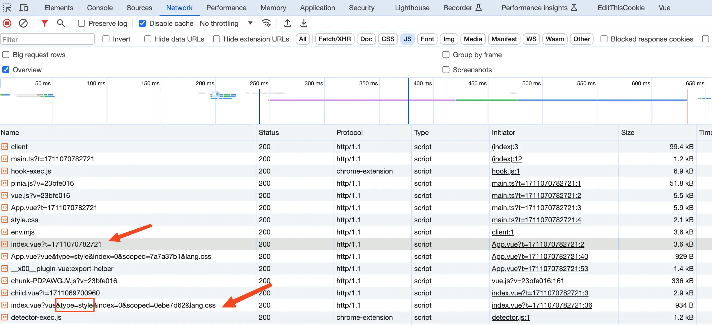
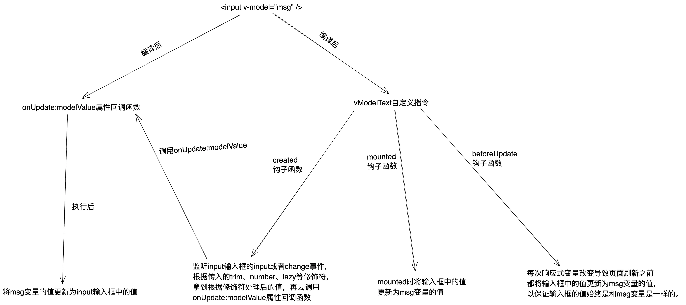

# 前言
在上一篇 [普通组件上面的v-model](/template/v-model-component) 文章中已经讲过了在组件中怎么将v-model编译成`:modelValue`属性和`@update:modelValue`事件，今天我们就来讲讲在原生input上面使用v-model和在组件上面使用有什么区别？

# 看个例子
下面这个是我写的一个demo，代码如下：
```vue
<template>
  <input v-model="msg" />
  <p>input value is: {{ msg }}</p>
</template>

<script setup lang="ts">
import { ref } from "vue";

const msg = ref();
</script>
```
上面的例子很简单，在原生input标签上面使用v-model绑定了`msg`变量。我们接下来看看编译后的js代码是什么样的，那么问题来了怎么找到编译后的js代码呢？

其实很简单直接在network上面找到你的那个vue文件就行了，比如我这里的文件是`index.vue`，那我只需要在network上面找叫`index.vue`的文件就行了。但是需要注意一下network上面有两个`index.vue`的js请求，分别是template模块+script模块编译后的js文件，和style模块编译后的js文件。

那怎么区分这两个`index.vue`文件呢？很简单，通过query就可以区分。由style模块编译后的js文件的URL中有type=style的query，如下图所示：
{data-zoomable}

接下来我们来看看编译后的`index.vue`，简化的代码如下：
```js
import {
  Fragment as _Fragment,
  createElementBlock as _createElementBlock,
  createElementVNode as _createElementVNode,
  defineComponent as _defineComponent,
  openBlock as _openBlock,
  toDisplayString as _toDisplayString,
  vModelText as _vModelText,
  withDirectives as _withDirectives,
  ref,
} from "/node_modules/.vite/deps/vue.js?v=23bfe016";

const _sfc_main = _defineComponent({
  __name: "index",
  setup(__props, { expose: __expose }) {
    __expose();
    const msg = ref();
    const __returned__ = { msg };
    return __returned__;
  },
});

function _sfc_render(_ctx, _cache, $props, $setup, $data, $options) {
  return (
    _openBlock(),
    _createElementBlock(
      _Fragment,
      null,
      [
        _withDirectives(
          _createElementVNode(
            "input",
            {
              "onUpdate:modelValue":
                _cache[0] || (_cache[0] = ($event) => ($setup.msg = $event)),
            },
            null,
            512
          ),
          [[_vModelText, $setup.msg]]
        ),
        _createElementVNode(
          "p",
          null,
          "input value is: " + _toDisplayString($setup.msg),
          1
        ),
      ],
      64
    )
  );
}
_sfc_main.render = _sfc_render;
export default _sfc_main;
```
从上面的代码中我们可以看到编译后的js代码主要分为两块。

第一块是`_sfc_main`组件对象，里面有name属性和setup方法。一个vue组件其实就是一个对象，这里的`_sfc_main`对象就是一个vue组件对象。

我们接着来看第二块`_sfc_render`，从名字我想你应该已经猜到了他是一个render函数。执行这个`_sfc_render`函数就会生成虚拟DOM，然后再由虚拟DOM生成浏览器上面的真实DOM。我们接下来主要看看这个render函数。
# render函数
这个`render`函数前面会调用`openBlock`函数和`createElementBlock`函数。他的作用是在编译时尽可能的提取多的关键信息，可以减少运行时比较新旧虚拟DOM带来的性能开销。我们这篇文章不关注这点，所以就不细讲了。

来看看里层的数组，数组中有两项。分别是`withDirectives`函数和`createElementVNode`函数，数组中的这两个函数分别对应的就是template中的input标签和p标签。我们主要来关注input标签，也就是`withDirectives`函数。
## `withDirectives`函数
这个`withDirectives`是否觉得有点眼熟？他是vue提供的一个进阶API，我们平时写业务基本不会用到他。作用是给vnode（虚拟DOM）增加自定义指令。

接收两个参数，第一个参数为需要添加指令的vnode，第二个参数是由自定义指令组成的二维数组。二维数组的第一层是表示有哪些自定义指令，第二层表示的是指令名称、绑定值、参数、修饰符。第二层的结构为： `[Directive, value, argument, modifiers]` 。如果不需要，可以省略数组的尾元素。

举个例子：
```js
import { h, withDirectives } from 'vue'

// 一个自定义指令
const pin = {
  mounted() {
    /* ... */
  },
  updated() {
    /* ... */
  }
}

// <div v-pin:top.animate="200"></div>
const vnode = withDirectives(h('div'), [
  [pin, 200, 'top', { animate: true }]
])
```
上面这个例子定义了一个`pin`的自定义指令，调用`h`函数生成vnode传给`withDirectives`函数的第一个参数。第二个参数自定义指令数组，我们这里只传了一个`pin`自定义指令。来看看`[Directive, value, argument, modifiers]`。

- 第一个`Directive`字段：“指令名称”对应的就是`pin`自定义指令。

- 第二个`value`字段：“指令值”对应的就是200。

- 第三个字段`argument`字段：“参数”对应的就是`top`参数。

- 第四个字段`modifiers`字段：“修饰符”对应的就是`animate`修饰符。

所以上面的`withDirectives`函数实际就是对应的`<div v-pin:top.animate="200"></div>`
## `createElementVNode`函数
看见这个函数名字我想你应该也猜到了，作用是创建vnode（虚拟dom）。这个函数和vue提供的 [h函数](https://cn.vuejs.org/api/render-function.html#h)差不多，底层调用的都是一个名为`createBaseVNode`的函数。接收的第一个参数既可以是一个字符串 (用于原生元素) 也可以是一个 Vue 组件定义。接收的第二个参数是要传递的 prop，第三个参数是子节点。

举个例子：
```js
createElementVNode("input", {
  value: 12,
})
```
上面这个例子创建了一个input的vnode，输入框中的值为12

搞清楚了`withDirectives`函数和`createElementVNode`函数的作用，我们回过头来看之前对应input标签的代码你应该就很容易理解了。代码如下：
```js
_withDirectives(
  _createElementVNode(
    "input",
    {
      "onUpdate:modelValue":
        _cache[0] || (_cache[0] = ($event) => ($setup.msg = $event)),
    },
    null,
    512
  ),
  [[_vModelText, $setup.msg]]
)
```
调用`withDirectives`函数，传入两个参数。第一个参数为调用`createElementVNode`函数生成input的vnode。第二个参数为传入的自定义指令组成的数组，很明显这里的二维数组的第一层只有一项，说明只传入了一个自定义指令。

回忆一下前面说的二维数组中的第二层的结构： `[Directive, value, argument, modifiers]`，第一个字段`Directive`表示这里传入了一个名为`vModelText`的自定义指令，第二个字段`value`表示给`vModelText`指令绑定的值为`$setup.msg`。我们在后面的 [setup函数](/script/what-setup)文章中会去讲，这里的`$setup.msg`实际就是指向的是setup中定义的名为`msg`的ref变量。

我们再来看里面的`createElementVNode`函数，创建一个input的vnode。传入了一个名为`onUpdate:modelValue`的props属性，属性值是一个经过缓存的回调函数。

为什么需要缓存呢？因为每次更新页面都会执行一次render函数，每次执行render函数都会调用一次`createElementVNode`函数。如果不缓存那不就变成了每次更新页面都会生成一个`onUpdate:modelValue`的回调函数。这里的回调函数也很简单，接收一个`$event`变量。这个`$event`变量就是输入框中输入的值，然后最新的输入框中的值同步到`setup`中的`msg`变量。

总结一下就是给input标签的vnode添加了一个`vModelText`的自定义指令，并且给指令绑定的值为`msg`变量。还有就是在input标签的vnode中添加了一个`onUpdate:modelValue`的属性，属性值是一个回调函数，触发这个回调函数就会将`msg`变量的值更新为输入框中的最新值。我们知道input输入框中的值对应的是value属性，监听的是input和change事件。那么这里有两个问题：
- 如何将`vModelText`自定义指令绑定的`msg`变量的值传递给input输入框中的value属性的呢？

- input标签监听input和change事件，编译后input上面却是一个名为`onUpdate:modelValue`的props回调函数？

要回答上面的两个问题我们需要看`vModelText`自定义指令是什么样的。
# `vModelText`自定义指令
`vModelText`是一个运行时的v-model指令，为什么说是运行时呢？ [普通组件上面的v-model](/template/v-model-component) 文章中我们已经讲过了，在编译时就会将组件上面的v-model指令编译成`modelValue`属性和`@update:modelValue`事件。所以当运行时在组件上已经没有了v-model指令了，只有原生input在运行时依然还有v-model指令，也就是`vModelText`自定义指令。

我们来看看`vModelText`自定义指令的代码：
```js
const vModelText = {
  created(el, { modifiers: { lazy, trim, number } }, vnode) {
    // ...
  },
  mounted(el, { value }) {
    // ...
  },
  beforeUpdate(el, { value, modifiers: { lazy, trim, number } }, vnode) {
    // ...
  },
}
```
从上面可以看到`vModelText`自定义指令中使用了三个钩子函数：`created`、`mounted`、`beforeUpdate`，我们来看看上面三个钩子函数中使用到的参数：
- `el`：指令绑定到的元素。这可以用于直接操作 DOM。

- `binding`：一个对象，包含以下属性。上面的例子中是直接解构了`binding`对象。

  - `value`：传递给指令的值。例如在 `v-model="msg"` 中，其中`msg`变量的值为“hello word”，`value`的值就是“hello word”。

  - `modifiers`：一个包含修饰符的对象，v-model支持`lazy`, `trim`, `number`这三个修饰符。

    - `lazy`：默认情况下，`v-model` 会在每次 `input` 事件后更新数据。你可以添加 `lazy` 修饰符来改为在每次 `change` 事件后更新数据，在input输入框中就是失去焦点时再更新数据。

    - `trim`：去除用户输入内容中两端的空格。

    - `number`：让用户输入自动转换为数字。

- `vnode`：绑定元素的 VNode（虚拟DOM）。

## `mounted`钩子函数
我们先来看`mounted`钩子函数，代码如下：
```js
const vModelText = {
  mounted(el, { value }) {
    el.value = value == null ? "" : value;
  },
}
```
`mounted`中的代码很简单，在`mounted`时如果v-model绑定的`msg`变量的值不为空，那么就将`msg`变量的值同步到input输入框中。
## `created`钩子函数
我们接着来看`created`钩子函数中的代码，如下：
```js
const assignKey = Symbol("_assign");
const vModelText = {
  created(el, { modifiers: { lazy, trim, number } }, vnode) {
    el[assignKey] = getModelAssigner(vnode);
    const castToNumber =
      number || (vnode.props && vnode.props.type === "number");
    addEventListener(el, lazy ? "change" : "input", (e) => {
      if (e.target.composing) return;
      let domValue = el.value;
      if (trim) {
        domValue = domValue.trim();
      }
      if (castToNumber) {
        domValue = looseToNumber(domValue);
      }
      el[assignKey](domValue);
    });
    if (trim) {
      addEventListener(el, "change", () => {
        el.value = el.value.trim();
      });
    }
    if (!lazy) {
      addEventListener(el, "compositionstart", onCompositionStart);
      addEventListener(el, "compositionend", onCompositionEnd);
    }
  },
}
```
`created`钩子函数中的代码主要分为五部分。
### 第一部分
首先我们来看第一部分代码：
```js
el[assignKey] = getModelAssigner(vnode);
```
我们先来看这个`getModelAssigner`函数。代码如下：
```js
const getModelAssigner = (vnode) => {
const fn = vnode.props["onUpdate:modelValue"];
return isArray(fn) ? (value) => invokeArrayFns(fn, value) : fn;
};
```
`getModelAssigner`函数的代码很简单，就是返回`vnode`上面名为`onUpdate:modelValue`的props回调函数。前面我们已经讲过了执行这个回调函数会同步更新v-model绑定的`msg`变量。

所以第一部分代码的作用就是取出input标签上面名为`onUpdate:modelValue`的props回调函数，然后赋值给input标签对象的`assignKey`方法上面，后面再输入框中的input或者chang事件触发时会手动调用。这个`assignKey`是一个Symbol，唯一的标识符。
### 第二部分
再来看第二部分代码：
```js
const castToNumber =
number || (vnode.props && vnode.props.type === "number");
```
`castToNumber`表示是否使用了`.number`修饰符，或者input输入框上面是否有`type=number`的属性。如果`castToNumber`的值为true，后续处理输入框的值时会将其转换成数字。
### 第三部分
我们接着来看第三部分的代码：
```js
addEventListener(el, lazy ? "change" : "input", (e) => {
if (e.target.composing) return;
let domValue = el.value;
if (trim) {
  domValue = domValue.trim();
}
if (castToNumber) {
  domValue = looseToNumber(domValue);
}
el[assignKey](domValue);
});
```
对input输入框进行事件监听，如果有`.lazy`修饰符就监听change事件，否则监听input事件。看看，这不就和`.lazy`修饰符的作用对上了嘛。`.lazy`修饰符的作用是在每次change事件触发时再去更新数据。
我们接着看里面的事件处理函数，来看看第一行代码：
```js
if (e.target.composing) return;
```
当用户使用拼音输入法输入汉字时，正在输入拼音阶段也会触发input事件的。但是一般情况下我们只希望真正合成汉字时才触发input去更新数据，所以在输入拼音阶段触发的input事件需要被return。至于`e.target.composing`什么时候被设置为`true`，什么时候又是`false`，我们接着会讲。

后面的代码就很简单了，将输入框中的值也就是`el.value`赋值给`domValue`变量。如果使用了`.trim`修饰符，就执行`trim`方法，去除掉`domValue`变量中两端的空格。

如果`castToNumber`的值为true，表示使用了`.number`修饰符或者在input上面使用了`type=number`。调用`looseToNumber`方法将`domValue`字符串转换为数字。

最后将处理后的`domValue`，也就是处理后的输入框中的输入值，作为参数调用`el[assignKey]`方法。我们前面讲过了`el[assignKey]`中存的就是input标签上面名为`onUpdate:modelValue`的props回调函数，执行`el[assignKey]`方法就是执行回调函数，在回调函数中会将v-model绑定的`msg`变量的值更新为处理后的输入框中的输入值。

现在你知道了为什么input标签监听input和change事件，编译后input上面却是一个名为`onUpdate:modelValue`的props回调函数了？

因为在input或者change事件的回调中会将输入框的值根据传入的修饰符进行处理，然后将处理后的输入框的值作为参数手动调用`onUpdate:modelValue`回调函数，在回调函数中更新绑定的msg变量。
### 第四部分
我们接着来看第四部分的代码，如下：
```js
if (trim) {
  addEventListener(el, "change", () => {
    el.value = el.value.trim();
  });
}
```
这一块代码很简单，如果使用了`.trim`修饰符，触发change事件，在input输入框中就是失去焦点时。就会将输入框中的值也trim一下，去掉前后的空格。

为什么需要有这块代码，前面在input或者change事件中不是已经对输入框中的值进行trim处理了吗？而且后面的`beforeUpdate`钩子函数中也执行了`el.value = newValue`将输入框中的值更新为v-model绑定的`msg`变量的值。

答案是：前面确实对输入框中拿到的值进行trim处理，然后将trim处理后的值更新为v-model绑定的msg变量。但是我们并没有将输入框中的值更新为trim处理后的，虽然在`beforeUpdate`钩子函数中会将输入框中的值更新为v-model绑定的msg变量。但是如果只是在输入框的前后输入空格，那么经过trim处理后在`beforeUpdate`钩子函数中就会认为输入框中的值和`msg`变量的值相等。就不会执行`el.value = newValue`，此时输入框中的值还是有空格的，所以需要执行第四部分的代码将输入框中的值替换为trim后的值。
### 第五部分
我们接着来看第五部分的代码，如下：
```js
if (!lazy) {
  addEventListener(el, "compositionstart", onCompositionStart);
  addEventListener(el, "compositionend", onCompositionEnd);
}
```
如果没有使用`.lazy`修饰符，也就是在每次input时都会对绑定的变量进行更新。

这里监听的`compositionstart`事件是：文本合成系统如开始新的输入合成时会触发 `compositionstart` 事件。举个例子：当用户使用拼音输入法开始输入汉字时，这个事件就会被触发。

这里监听的`compositionend`事件是：当文本段落的组成完成或取消时，compositionend 事件将被触发。举个例子：当用户使用拼音输入法，将输入的拼音合成汉字时，这个事件就会被触发。

来看看`onCompositionStart`中的代码，如下：
```js
function onCompositionStart(e) {
  e.target.composing = true;
}
```
代码很简单，将`e.target.composing`设置为true。还记得我们前面在input输入框的input或者change事件中会先去判断这个`e.target.composing`，如果其为true，那么就return掉，这样就不会在输入拼音时也会更新v-model绑定的`msg`变量了。

我们来看看`onCompositionEnd`中的代码，如下：
```js
function onCompositionEnd(e) {
  const target = e.target;
  if (target.composing) {
    target.composing = false;
    target.dispatchEvent(new Event("input"));
  }
}
```
当将拼音合成汉字时会将`e.target.composing`设置为false，这里为什么要调用`target.dispatchEvent`手动触发一个input事件呢？

答案是：将拼音合成汉字时input事件会比compositionend事件先触发，由于此时的`e.target.composing`的值还是true，所以input事件中后续的代码就会被return。所以才需要将`e.target.composing`重置为false后，手动触发一个input事件，更新v-model绑定的`msg`变量。
## `beforeUpdate`钩子函数
我们接着来看看`beforeUpdate`钩子函数，会在每次因为响应式状态变更，导致页面更新之前调用，代码如下：
```js
const vModelText = {
  beforeUpdate(el, { value, modifiers: { lazy, trim, number } }, vnode) {
    el[assignKey] = getModelAssigner(vnode);
    // avoid clearing unresolved text. #2302
    if (el.composing) return;

    const elValue =
      number || el.type === "number" ? looseToNumber(el.value) : el.value;
    const newValue = value == null ? "" : value;

    if (elValue === newValue) {
      return;
    }

    if (document.activeElement === el && el.type !== "range") {
      if (lazy) {
        return;
      }
      if (trim && el.value.trim() === newValue) {
        return;
      }
    }

    el.value = newValue;
  },
};
```
看完了前面的`created`函数，再来看这个`beforeUpdate`函数就很简单了。`beforeUpdate`钩子函数最终要做的事情就是最后的这行代码：
```js
el.value = newValue;
```
这行代码的意思是将输入框中的值更新成v-model绑定的`msg`变量，为什么需要在`beforeUpdate`钩子函数中执行呢？

答案是`msg`是一个响应式变量，如果在父组件上面因为其他原因改变了`msg`变量的值后，这个时候就需要将input输入框中的值同步更新为最新的msg变量。这也就解释了我们前面的问题：如何将`vModelText`自定义指令绑定的`msg`变量的值传递给input输入框中的value属性的呢？

第一行代码是：
```js
el[assignKey] = getModelAssigner(vnode);
```
这里再次将`vnode`上面名为`onUpdate:modelValue`的props回调函数赋值给`el[assignKey]`，之前在`created`的时候不是已经赋值过一次了吗，这里为什么会再次赋值呢？

答案是在有的场景中是不会缓存`onUpdate:modelValue`回调函数，如果没有缓存，那么每次执行render函数都会生成新的`onUpdate:modelValue`回调函数。所以才需要在`beforeUpdate`钩子函数中每次都将最新的`onUpdate:modelValue`回调函数赋值给`el[assignKey]`，当在input或者change事件触发时执行`el[assignKey]`的时候就是执行的最新的`onUpdate:modelValue`回调函数。

再来看看第二行代码，如下：
```js
// avoid clearing unresolved text. #2302
if (el.composing) return;
```
这行代码是为了修复bug：如果在输入拼音的过程中，还没有合成汉字之前。如果有其他的响应式变量的值变化导致页面刷新，这种时候就应该return。否则由于此时的msg变量的值还是null，如果执行`el.value = newValue`，输入框中的输入值就会被清空。详情请查看issue： [https://github.com/vuejs/core/issues/2302](https://github.com/vuejs/core/issues/2302)

后面的代码就很简单了，其中的`document.activeElement`属性返回获得当前焦点（focus）的 DOM 元素，还有`type =  "range"`我们平时基本不会使用。根据使用的修饰符拿到处理后的input输入框中的值，然后和v-model绑定的`msg`变量进行比较。如果两者相等自然不需要执行`el.value = newValue`将输入框中的值更新为最新值。
# 总结
现在来看这个流程图你应该就很容易理解了：
{data-zoomable}
在组件上面使用v-model和原生input上面使用v-model区别主要有三点：
- 组件上面的v-model编译后会生成`modelValue`属性和`@update:modelValue`事件。

  而在原生input上面使用v-model编译后不会生成`modelValue`属性，只会生成`onUpdate:modelValue`回调函数和`vModelText`自定义指令。（在 [普通组件上面的v-model](/template/v-model-component) 文章中我们已经讲过了`@update:modelValue`事件其实等价于`onUpdate:modelValue`回调函数）

- 在组件上面使用v-model，是由子组件中定义一个名为`modelValue`的props来接收父组件使用v-model绑定的变量，然后使用这个`modelValue`绑定到子组件的表单中。

  在原生input上面使用v-model，是由编译后生成的`vModelText`自定义指令在`mounted`和`beforeUpdate`钩子函数中去将v-model绑定的变量值更新到原生input输入框的value属性，以保证v-model绑定的变量值和input输入框中的值始终一致。

- 在组件上面使用v-model，是由子组件使用emit抛出`@update:modelValue`事件，在`@update:modelValue`的事件处理函数中去更新v-model绑定的变量。

  而在原生input上面使用v-model，是由编译后生成的`vModelText`自定义指令在`created`钩子函数中去监听原生input标签的input或者change事件。在事件回调函数中去手动调用`onUpdate:modelValue`回调函数，然后在回调函数中去更新v-model绑定的变量。


[加入本书对应的「源码交流群」](/guide/contact)
